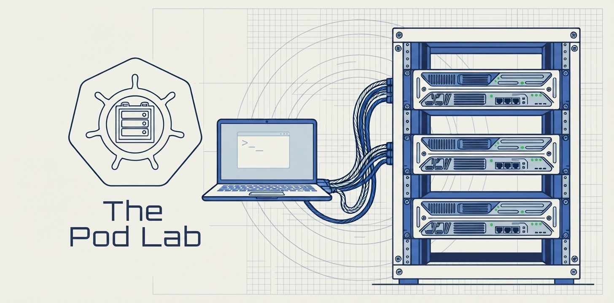
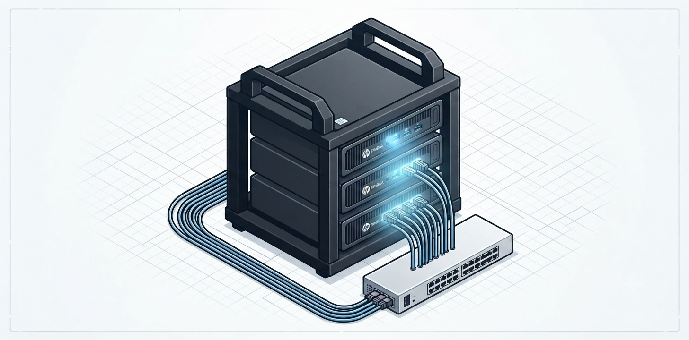

 

---

## The Pod Lab

<table>
<tr>
<td width="45%" valign="top">

  

</td>
<td width="55%" valign="top">

A physical **three-node HP EliteDesk mini cluster** in a 3D-printed desktop rack — my dedicated environment for cloud-native experimentation, infrastructure automation, and endless curiosity.

**Hardware** · 3× HP EliteDesk 800 G2 Mini, bare-metal kubeadm  
**Stack** · Kubernetes, Calico, GitOps, automated cluster lifecycle  
**Next up** · Evaluating cluster monitoring & management tooling

</td>
</tr>
</table>

---

## 🎙️ Pod Talk

Kubernetes networking, security, and platform engineering — explained by building it.

---

## 🎓 Certifications

---

### 📌 Connect

